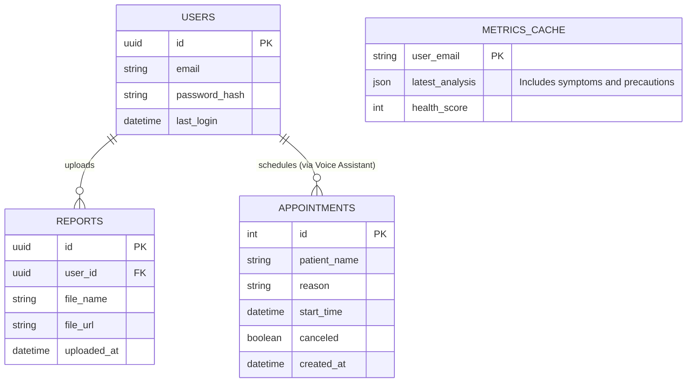

# MediFlow Database Design (ERD)

The system uses a hybrid storage approach: **Local Storage** for instant performance, **SQLite** for the Voice Assistant, and **Supabase** for secure cloud synchronization.

## Storage Strategy:
1.  **Call Assistant (SQLite):** Dedicated to handling high-concurrency tool calls from Vapi. It ensures that even if the internet is slow, the voice agent can immediately read/write appointment slots.
2.  **Cloud Storage (Supabase):** Stores sensitive data like user credentials and raw report metadata to ensure security and multi-device access.
3.  **Client Cache (LocalStorage):** Used to store the most recent AI Analysis. This allows the Dashboard and Digital Body Map to render instantly without waiting for an API call on every refresh.
