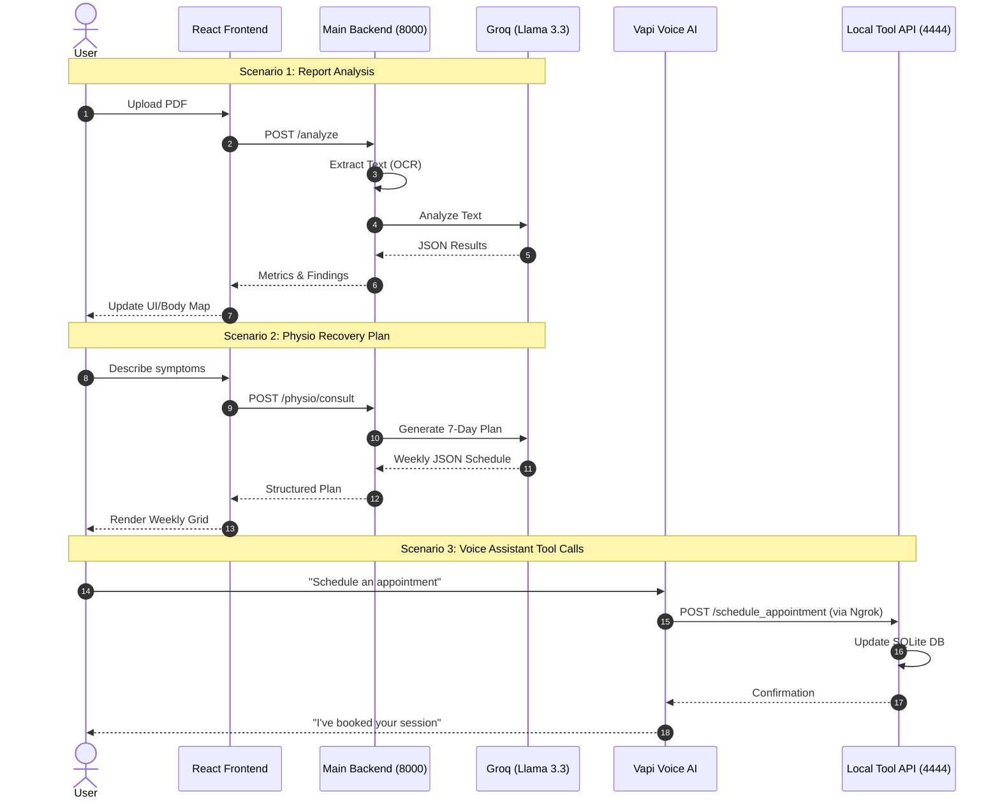

# MediFlow Sequence Flow

This diagram illustrates the end-to-end interactions between the user, the platform, and the AI services.

## Flow Details:
1. **Medical Report Flow:** Converts raw unstructured PDFs into actionable medical metrics using Llama 3.1.
2. **Physio Consultation Flow:** Uses Llama 3.3 70B on Groq for high-intelligence physiological planning.
3. **Voice Automation Flow:** Uses `ngrok` to bridge Vapi's cloud environment with your local `call_assistant` backend for real-time tool execution.
